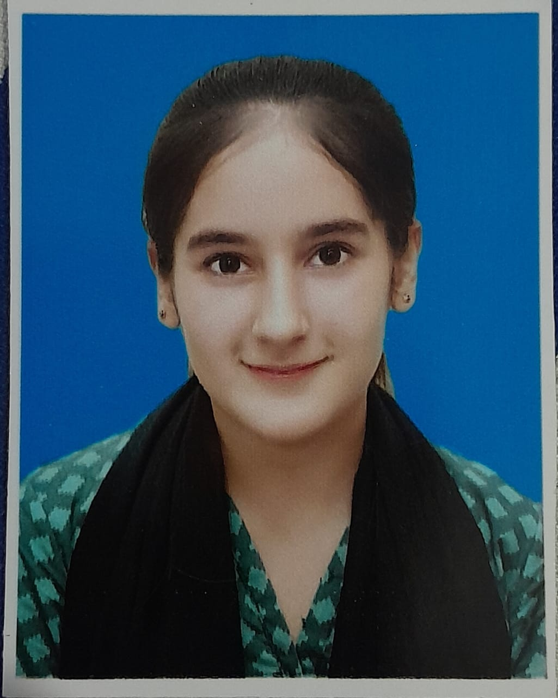

# Shardha

## Summary 
Aspiring AI/ML Engineer and Computer Science student focused on machine learning algorithms, data structures, and intelligent backend systems. 

## Education
**BS Computer Science**\n
*FAST National University of Computer & Emerging Sciences*

## -Skills
* HTML, CSS & Java-script
* Python
* Also worked on FastAPI and Database.

## Projects
Netflix Clone,
Amazon Clone,
Hospital Appointment system using Python,
Elite Travel & Currency Hub.

## Hobbies & Extracurriculars
**Playing badminton**
- [x] Buy new racket
- [ ] Join the university sports club
- [x] Practicing every morning

**Reading books**
- [x] learning vocabulary
- [ ] Reading 20 pages a day
- [x] learning something new

**Learning French**
- [ ] practice basic vocabulary
- [ ] read a French book
      

